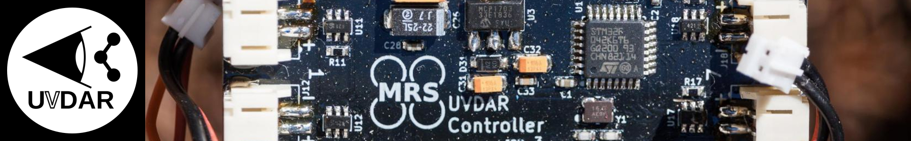
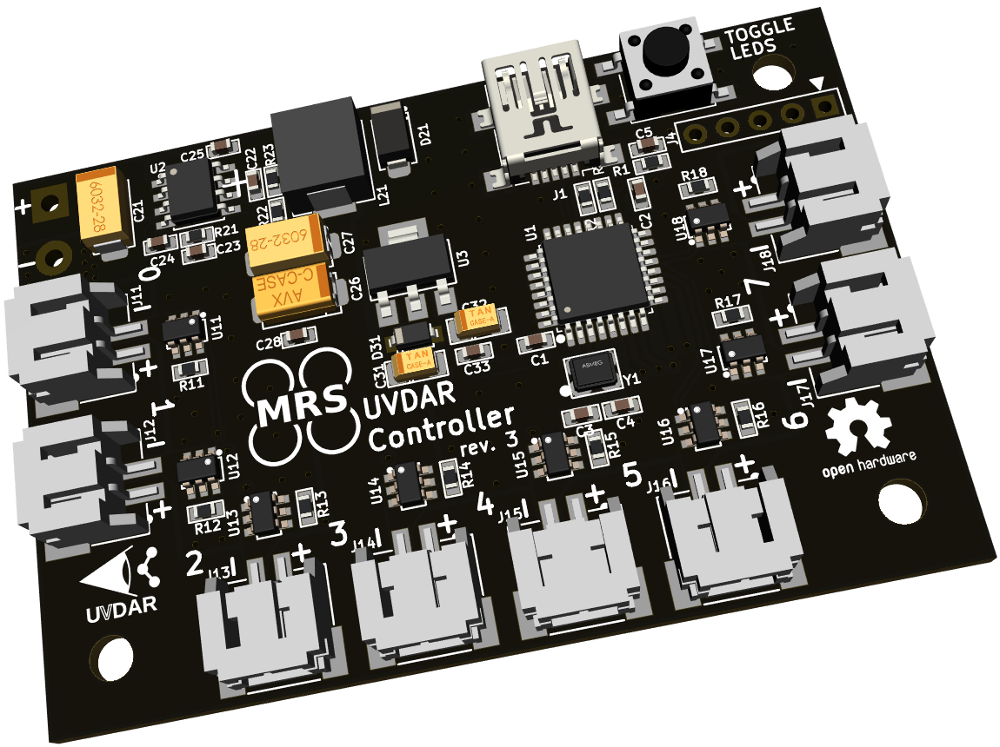
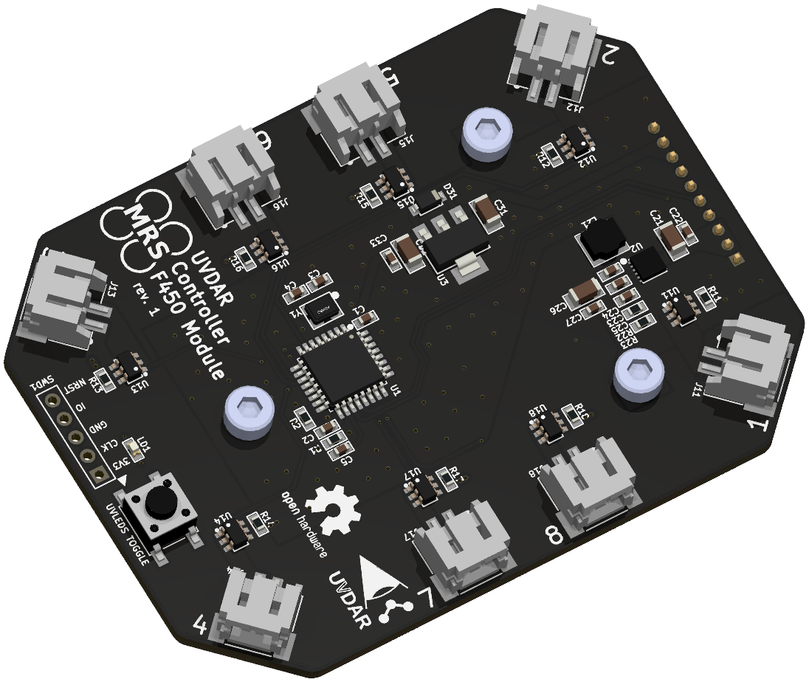

# UVDAR Hardware

## Description
This package contains hardware for UVDAR. 
[UVDAR](https://github.com/ctu-mrs/uvdar_core) Hardware is available in two variants: standalone and as MRS Module. 

The standalone variant can be connected to a computer directly using USB and is intended for quick development and trying out UVDAR. 
The MRS Module variant is intended to be used along with MRS Distribution Boards, namely with F450 Distribution Board as this is so far the
only Distribution board populated with a slot for a Big MRS Module.

<table>
  <tr>
    <th>
      UVDAR Standalone Variant
    </th>
    <th>
      UVDAR Module Variant
    </th>
  </tr>
  <tr>
    <td>
      
    </td>
    <td>
      
    </td>
  </tr>
</table>

## How to use
1) Read the documentation provided with each variant.
2) Select which variant suits your needs better (note that you can use MRS Module Host Board for development with MRS Module variant).
3) Manufacture and assemble the PCB of the controller and the UV LEDs. The Gerber files as well as BOM is in the PCB folder of each variant.
4) Flash the control board with appropriate firmware using STM32CubeIDE, Atollic TrueSTUDIO, Keil uVision or STM32CubePRogrammer or any other software you like to use.
5) Connect the controller to a computer and use the [UVDAR ROS Package](https://github.com/ctu-mrs/uvdar_core).
